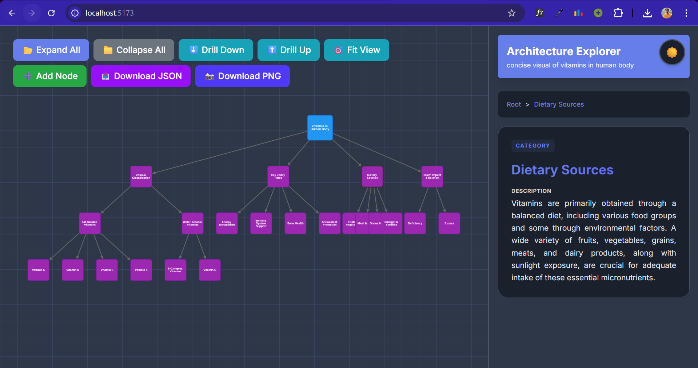
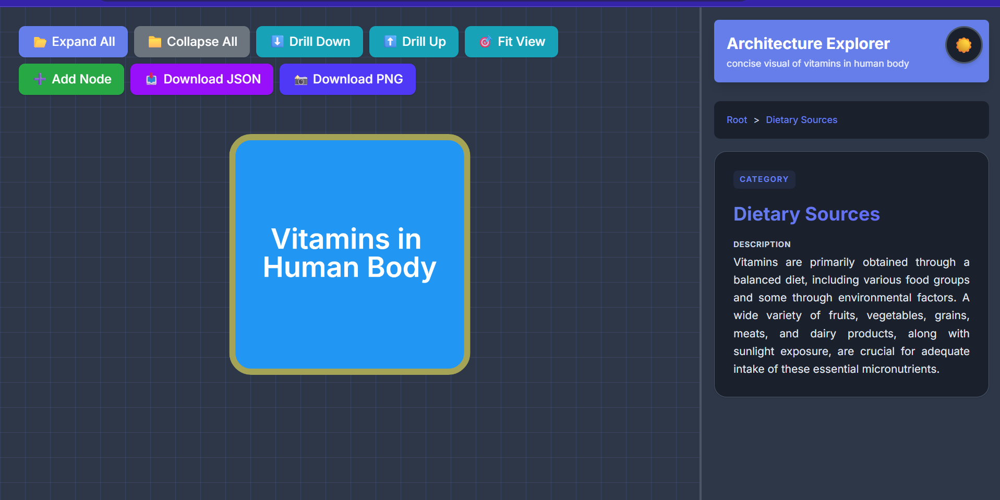
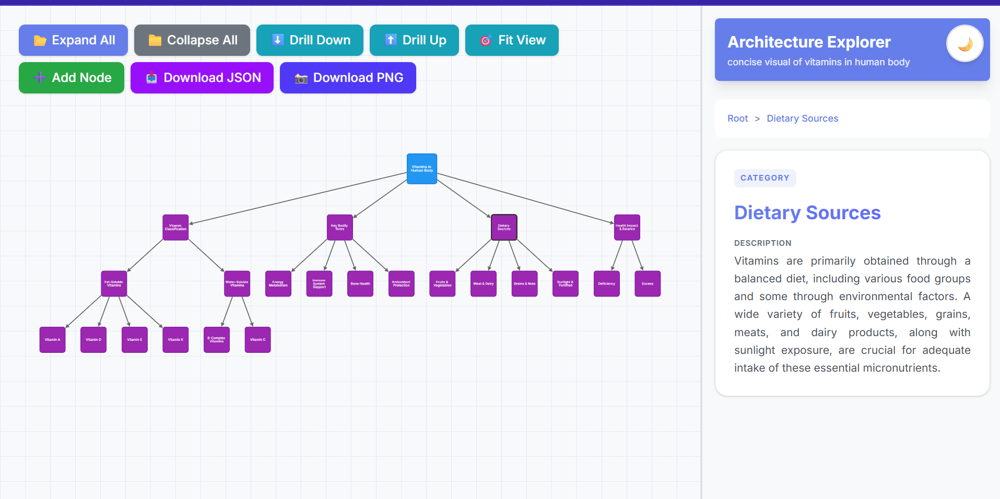

# Interactive Mindmap Visualizer

An interactive, hierarchical mindmap visualization tool built with React and Cytoscape.js, featuring localStorage persistence, dynamic graph manipulation, and multiple export formats.


## � Screenshots

### Dark Mode - Expanded View



### Collapsed View



### Light Mode



## �🚀 Features

- **Interactive Graph Visualization** - Pan, zoom, and interact with hierarchical node structures
- **Dynamic Node Management** - Add, rename, edit, delete, and connect nodes in real-time
- **Hierarchy Controls** - Expand/collapse all, drill down/up through levels
- **LocalStorage Persistence** - Automatic save/load of mindmap state across sessions
- **Multiple Export Formats** - Download as JSON (data) or PNG (visualization)
- **Connection Mode** - Create custom connections between any nodes
- **Context Menus** - Right-click actions for quick node operations
- **Responsive Design** - Adapts to different screen sizes with mobile support
- **Theme Support** - Light and dark mode with smooth transitions
- **Real-time Preview** - Hover over nodes to see quick previews in the sidebar

---

## 🛠️ Technologies Used

### Core Framework

- **React 19.2.0** - Modern component-based UI library with latest features including concurrent rendering
- **Vite 7.2.4** - Ultra-fast development server and build tool with HMR (Hot Module Replacement)

### Build & Development

- **Bun** - Fast JavaScript runtime and package manager
- **ESLint 9.39.1** - Code quality and consistency enforcement
- **PostCSS 8.5.6** - CSS transformations and optimizations

### Styling

- **TailwindCSS 4.1.18** - Utility-first CSS framework for rapid UI development
- **@tailwindcss/vite 4.1.18** - Vite integration for Tailwind CSS

---

## 📚 Libraries Used

### Graph Visualization

**[Cytoscape.js](https://js.cytoscape.org/) v3.33.1**

- **Purpose:** Core graph theory library for rendering and manipulating network visualizations
- **Why:** Industry-standard graph visualization with extensive features, excellent performance, and rich API
- **Features Used:**
  - Node and edge rendering with custom styling
  - Event handling (tap, hover, right-click)
  - Layout algorithms (Dagre integration)
  - PNG export functionality
  - Dynamic graph manipulation

**[Cytoscape-Dagre](https://github.com/cytoscape/cytoscape.js-dagre) v2.5.0**

- **Purpose:** Directed Acyclic Graph (DAG) layout extension for Cytoscape
- **Why:** Provides hierarchical tree/graph layouts perfect for mindmap visualization
- **Features Used:**
  - Top-to-bottom rankDir layout
  - Automatic node positioning based on hierarchy
  - Configurable spacing and padding

**[Dagre](https://github.com/dagrejs/dagre) v0.8.5**

- **Purpose:** Graph layout engine (peer dependency for cytoscape-dagre)
- **Why:** Required by cytoscape-dagre for layout calculations

### UI Components

**React 19.2.0 & React-DOM 19.2.0**

- **Purpose:** Core UI framework
- **Why:** Component-based architecture, virtual DOM, hooks for state management
- **Features Used:**
  - `useState` for local state management
  - `useEffect` for side effects (localStorage, Cytoscape initialization)
  - `useCallback` for performance optimization
  - `useRef` for DOM and instance references

---

## 🏗️ Architecture & Approach

### Overall Architecture

```
┌─────────────────────────────────────────────────────────────┐
│                         App.jsx                              │
│  (Main Component - State Management & Orchestration)         │
├─────────────────────────────────────────────────────────────┤
│                                                               │
│  ┌──────────────┐  ┌──────────────┐  ┌──────────────┐      │
│  │  Data State  │  │ UI State     │  │ Cytoscape    │      │
│  │              │  │              │  │ Instance     │      │
│  │ • nodes      │  │ • theme      │  │              │      │
│  │ • edges      │  │ • selected   │  │ • cyRef      │      │
│  │ • hierarchy  │  │ • hovered    │  │ • container  │      │
│  │ • metadata   │  │ • modal      │  │              │      │
│  └──────────────┘  └──────────────┘  └──────────────┘      │
│                                                               │
│  ┌──────────────────────────────────────────────────────┐   │
│  │          Core Functionality Modules                   │   │
│  │                                                        │   │
│  │  • LocalStorage (Save/Load)                           │   │
│  │  • Graph Manipulation (Add/Edit/Delete)               │   │
│  │  • Hierarchy Management (Expand/Collapse)             │   │
│  │  • Export (JSON/PNG)                                  │   │
│  │  • Event Handlers (Click/Hover/Context Menu)          │   │
│  └──────────────────────────────────────────────────────┘   │
│                                                               │
└─────────────────────────────────────────────────────────────┘
         │                    │                    │
         ▼                    ▼                    ▼
┌─────────────────┐  ┌──────────────┐   ┌──────────────────┐
│  Modal.jsx      │  │ index.css    │   │ data.js          │
│  (UI Component) │  │ (Styling)    │   │ (Initial Data)   │
└─────────────────┘  └──────────────┘   └──────────────────┘
```

### Component Architecture

#### **App.jsx** - Main Container (850+ lines)

The central orchestrator managing all state and functionality:

**State Management:**

- `data` - Core mindmap data structure (nodes, edges, hierarchy, metadata)
- `theme` - UI theme (light/dark)
- `selectedNode` - Currently selected node for sidebar display
- `hoveredNode` - Node being hovered for preview
- `currentLevel` - Current drill-down level
- `contextMenu` - Right-click menu state
- `connectionMode` - Connection creation state
- `modal` - Modal dialog state

**Core Features:**

- Graph initialization and lifecycle management
- Event handling (tap, hover, context menu)
- CRUD operations for nodes and edges
- Hierarchy navigation (expand/collapse, drill up/down)
- LocalStorage persistence
- Export functionality

#### **Modal.jsx** - Reusable Dialog Component

Generic modal for user input:

- Add/rename nodes
- Edit descriptions
- Delete confirmations
- Customizable styling (primary/danger variants)

#### **data.js** - Initial Data Structure

Defines the default mindmap structure:

- Sample nodes with rich metadata
- Edge relationships
- Hierarchical structure
- Topic metadata

#### **index.css** - Global Styling

- CSS custom properties for theming
- Theme-specific variables
- Tailwind integration
- Utility classes

---

## 📊 Data Flow Architecture

### 1. **Initialization Flow**

```
Application Start
       │
       ▼
┌──────────────────┐
│ loadInitialData()│
└──────────────────┘
       │
       ├──── Try to load from localStorage
       │     │
       │     ├── Success? → Parse and validate JSON
       │     │               │
       │     │               ├── Valid structure? → Use saved data
       │     │               │
       │     │               └── Invalid? → Use initialData
       │     │
       │     └── Error/No data? → Use initialData (from data.js)
       │
       ▼
┌──────────────────────┐
│ setData(initialData) │ ← React State
└──────────────────────┘
       │
       ▼
┌────────────────────────┐
│ useEffect - Initialize │
│ Cytoscape Instance     │
└────────────────────────┘
       │
       ├── Convert data.nodes → Cytoscape nodes
       ├── Convert data.edges → Cytoscape edges
       └── Apply Dagre layout
       │
       ▼
┌────────────────────┐
│ Render Canvas      │
│ Render Sidebar     │
└────────────────────┘
```

### 2. **Data Structure**

The core data model follows this structure:

```javascript
{
  metadata: {
    topic: string,           // Subject/title of the mindmap
    contentType: string,     // Type identifier
    nodeCount: number        // Total node count
  },
  nodes: [
    {
      id: string,           // Unique identifier
      data: {
        label: string,      // Display name
        type: string,       // Visual category (root/category/component)
        summary: string     // Description text
      }
    }
  ],
  edges: [
    {
      id: string,           // Unique identifier
      source: string,       // Source node ID
      target: string,       // Target node ID
      type: string          // Relationship type
    }
  ],
  hierarchy: {
    [nodeId]: [childIds]    // Parent → Children mapping
  }
}
```

### 3. **User Interaction Flow**

```
User Action (Click/Type/Drag)
       │
       ▼
Event Handler (App.jsx)
       │
       ├── Add Node
       │   │
       │   ├── Generate unique ID
       │   ├── Create node object
       │   ├── Update React state (setData)
       │   ├── Add to Cytoscape instance (cy.add)
       │   └── Apply layout
       │
       ├── Edit Node
       │   │
       │   ├── Open modal with current values
       │   ├── User confirms changes
       │   ├── Update React state
       │   └── Update Cytoscape node data
       │
       ├── Delete Node
       │   │
       │   ├── Remove from React state
       │   └── Remove from Cytoscape (node.remove)
       │
       └── Connect Nodes
           │
           ├── Enter connection mode
           ├── Select source node
           ├── Select target node
           ├── Create edge in state
           └── Add edge to Cytoscape
       │
       ▼
State Update Triggers
       │
       ├── useEffect (data dependency)
       │   │
       │   └── Save to localStorage
       │
       └── Re-render
           │
           ├── Update Cytoscape visualization
           └── Update sidebar/UI
```

### 4. **LocalStorage Persistence Flow**

```
Data State Changes
       │
       ▼
useEffect Hook (watches 'data')
       │
       ├── Try: localStorage.setItem(STORAGE_KEY, JSON.stringify(data))
       │
       ├── Catch: QuotaExceededError → Alert user
       │
       └── Success → Data persisted


Page Refresh
       │
       ▼
loadInitialData() called
       │
       ├── localStorage.getItem(STORAGE_KEY)
       │
       ├── Parse JSON
       │
       ├── Validate structure
       │
       └── Return saved data or fallback to initialData
```

### 5. **Export Flow**

#### JSON Export

```
User clicks "Download JSON"
       │
       ▼
exportAsJSON()
       │
       ├── Serialize data state to JSON (pretty print)
       ├── Create Blob from JSON string
       ├── Generate Object URL
       ├── Create temporary <a> element
       ├── Set download filename: mindmap-{timestamp}.json
       ├── Trigger click
       ├── Cleanup (remove element, revoke URL)
       └── Success or Error handling
```

#### PNG Export

```
User clicks "Download PNG"
       │
       ▼
exportAsPNG()
       │
       ├── Call cy.png() with options:
       │   ├── output: "blob"
       │   ├── bg: theme-based background color
       │   ├── full: true (entire graph)
       │   └── scale: 2 (high quality)
       │
       ├── Receive PNG blob from Cytoscape
       ├── Create Object URL
       ├── Create temporary <a> element
       ├── Set download filename: mindmap-{timestamp}.png
       ├── Trigger click
       ├── Cleanup (remove element, revoke URL)
       └── Success or Error handling
```

---

## 🎨 Styling Approach

### CSS Architecture

- **CSS Custom Properties** - Theme variables for consistent styling
- **TailwindCSS Utilities** - Rapid component styling
- **Dynamic Classes** - React-controlled class names for state-based styles

### Theme System

```css
:root[data-theme="light"] {
  --bg-primary: #ffffff;
  --text-primary: #1a1a1a;
  /* ... */
}

:root[data-theme="dark"] {
  --bg-primary: #1a1a1a;
  --text-primary: #f5f5f5;
  /* ... */
}
```

Theme is toggled via `toggleTheme()` and persisted in localStorage.

---

## 🚦 Getting Started

### Prerequisites

- Node.js 18+ or Bun runtime
- Modern web browser

### Installation

```bash
# Clone the repository
git clone <repository-url>
cd mindmap

# Install dependencies (using Bun)
bun install

# Or using npm
npm install
```

### Development

```bash
# Start development server
bun dev

# Or
npm run dev
```

Visit `http://localhost:5173` in your browser.

### Build for Production

```bash
# Create optimized build
bun run build

# Preview production build
bun run preview
```

---

## 📂 Project Structure

```
mindmap/
├── src/
│   ├── components/
│   │   └── UI/
│   │       └── Modal.jsx          # Reusable modal component
│   ├── App.jsx                     # Main application component
│   ├── data.js                     # Initial mindmap data
│   ├── index.css                   # Global styles & theme
│   └── main.jsx                    # React entry point
├── public/                         # Static assets
├── index.html                      # HTML template
├── package.json                    # Dependencies & scripts
├── vite.config.js                  # Vite configuration
└── README.md                       # This file
```

---

## 🎯 Key Implementation Details

### Performance Optimizations

- **useCallback** hooks for expensive functions to prevent re-creation
- **useRef** for Cytoscape instance to avoid re-initialization
- **Debounced localStorage** writes via useEffect
- **Virtual rendering** by Cytoscape for large graphs

### Error Handling

- LocalStorage quota exceeded alerts
- Data validation on load
- Graceful fallbacks for unsupported features
- User-friendly error messages

### Accessibility

- Keyboard navigation support
- Semantic HTML structure
- ARIA labels on interactive elements
- High contrast theme support

---

## 🔧 Configuration

### Vite Config

- React plugin for JSX transformation and Fast Refresh
- TailwindCSS Vite plugin for optimal CSS processing

### Cytoscape Styling

Customizable via `getStylesheet()` function in `App.jsx`:

- Node colors by type
- Edge styling
- Hover effects
- Selection indicators

---

## 📝 Usage Guide

### Basic Operations

1. **Add Node** - Click green "➕ Add Node" button or right-click canvas
2. **Edit Node** - Right-click node → Rename or Edit Description
3. **Delete Node** - Right-click node → Remove Node
4. **Connect Nodes** - Right-click source → "Connect to..." → Click target
5. **Expand/Collapse** - Click node to toggle children visibility
6. **Export** - Click "📥 Download JSON" or "📸 Download PNG"

### Navigation

- **Pan** - Click and drag canvas
- **Zoom** - Mouse wheel or pinch gesture
- **Fit View** - Click "🎯 Fit View" to center all visible nodes
- **Drill Down/Up** - Step through hierarchy levels

---

## 🤝 Contributing

Contributions are welcome! Please follow these guidelines:

1. Fork the repository
2. Create a feature branch
3. Commit your changes
4. Push to the branch
5. Open a Pull Request

---

## 📄 License

This project is open source and available under the MIT License.

---

## 🐛 Known Issues & Future Improvements

### Potential Enhancements

- [ ] Undo/Redo functionality
- [ ] Node search and filtering
- [ ] Multiple mindmap management
- [ ] Collaborative editing
- [ ] Import from JSON/other formats
- [ ] Custom themes and color schemes
- [ ] Node icons and images
- [ ] Export to PDF/SVG formats

---

## 📧 Contact & Support

For questions, issues, or feature requests, please open an issue on the repository.

---

**Built with ❤️ by Jeet Das**
